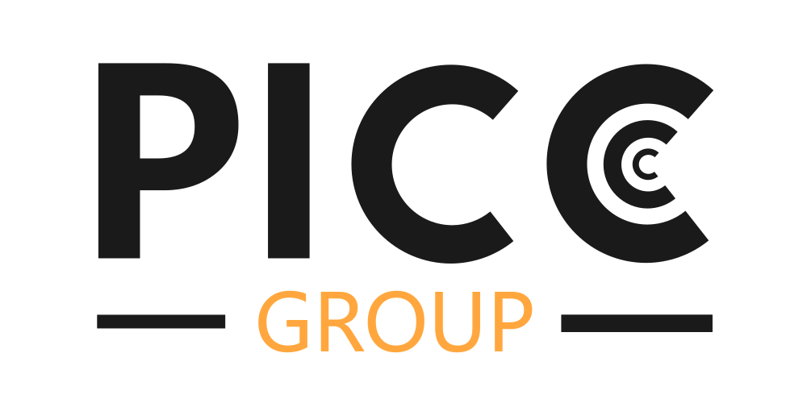

# Code for processing nanoVNA prameters for controlling RC car.
This code is devoloped by The PICC Group at Lund University for the 2024 IEEE AP-S Student Design Contest. The purpose of the is to process signals from a nanoVNA-setup to controll a RC car.

## Setup
...
### The PICC Group
The PICC Group is a project in the 2024 IEEE AP-S Student Design Contest. 
[The PICC Group Website](https://picc-group.github.io)

##### Members
- Teo Bergkvist
- Otto Edgren
- Oscar Gren
- Måns Jacobsson
- Christian Nelson
- Dr. Johan Lundgren (Mentor)
